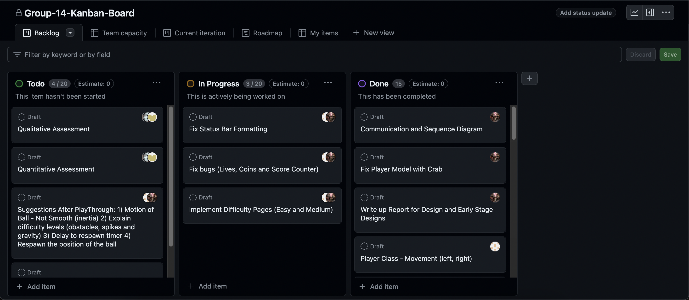

# 2024-group-14

## Game Video
### Deep Sea Fall

Click on the video above to view our game! 

## Team
### Hao Lu, Jiarong Zhang, Boyang Lin, Tanmay Mishra, Elvis Yung 

## Introduction 

Our creative inspiration is drawn from a classic Nokia game called "Rapid Roll." On top of preserving its original fun and entertainment, we've added a map inversion feature on the hardest level for the "twist": the player will need to survive by jumping instead of continuing to fall for some time. Throughout the whole game's development process, we've engaged in extensive collaboration to find the most suitable development approach for our team. We ended up choosing Kanban and agile development as our core principles due to their flexibility in developing without clear constraints which helped us iteratively improve our game. Furthermore, this assisted us in constantly reflecting, adjusting and discussing our plans and weekly tasks to better our team's ability to collaborate outside of weekly sessions. 

## Requirements

### Ideation Process
To kick off this unit, we first had an in-person brain-storming session to discuss the kind of games we're interested in and what makes our game idea feasible to create in processing. We generated around 6 well-thought-out game ideas with 3 challenges and a twist associated with each game idea. As a group, we unanimously voted and decided on two games, Flappy Butterfly (a variation of Flappy Bird) and Rapid Roll, a falling platformer game. For both games, we collated requirements such as use case diagrams specifications and user stories to further narrow down our choices. These specifications allowed us to develop basic paper prototypes to demonstrate our game in its simplest form - [Flappy Butterfly](https://www.youtube.com/watch?v=lpQTw_9nIlE) and [Rapid Roll](https://www.youtube.com/shorts/F4jMOeVJRp0). Ultimately, we ended up choosing Rapid Roll as our game as it's complex and challenging enough to develop a suitable twist and keep the players engaged. Moreover, as a team, we were more invested in the potential Rapid Roll has due to its simple nature, allowing us to construct interesting storylines and challenges. 

### Early stages design
During the early stages of the design process, we began to iterate on the game that was chosen as our template - Rapid Roll. We wanted to incorporate elements of pixel art and retro-like aspects in our game since all of us shared fond memories of playing these games in our childhood. Because of this, Rapid Roll was the perfect game for us to develop interesting challenges and captivating lore behind our game. We believe that creating a simple, but challenging and impressionable, game would captivate the players and have them coming back for more. 

During our discussions, we identified what game mechanics and graphics we would like to be incorporated in our game and drew mock-ups of what it would look like on an iPad. This allowed us to visualise the final game which motivated all of us to be invested in the development process. These images represent an early rough draft of our game with different levels incorporated and what the main game page would look like. As a team, we also wanted to immerse the player in a lore-like environment by designing our graphics based on a deep sea theme (spikes, crabs and shark teeth). Furthermore, as we continued to refine our ideas, different iterations of mock-ups were drew up to represent the ideas of the team. 

Overall, the early stage design process consisted of discussions around appropriate themes, game mechanics, challenges and difficulty levels. We wanted these elements to be represented throughout our game and we believe that creating mock-ups early on helped us envision the final product. Because of this, we have a clear vision of what the game would look like and are confident that it will bring different elements of enjoyment to players.

### Technical Requirements
- A home screen where the player can select the difficulty modes, see the controls for the game and read about the lore behind the game.
- Different difficulty levels for players to select: easy, medium and hard.
- Generation of platforms, obstacles (spikes and moving platforms) and coins at random locations on the map. 
- Keeping a record of the high scores of all the players that played the game and their difficulty level. 
- Placing obstacles and coins randomly on platforms according to difficulty level. 
- Adjusting the speed of play according to the level of difficulty level.
- Allowing players to jump due to the inverted direction of the map during  the hardest level. 

### User stories

> "⁠As a player, I want to be able to choose a difficulty level for the game to suit my style of play better"

> "⁠As a player, I want to be able to see a scoreboard and compare myself with my peers"

> "As a player, I want to see my score and lives left on the screen as I play the game"

> "As a player, I want to be warned of the map inversion so that I can prepare myself"

> "⁠⁠As a player, I want to see the rules of the game before playing it, so that I can prepare myself for the challenges ahead"

> "As a player, I want to be able to see the lore/story-line behind the game so that I can immerse myself and be invested in the game"  

### Use-Case Diagram
As a team, we created a use-case diagram to illustrate the functional components of our game to help visualise the required components in our game. During the development phase of our use-case diagram, we held discussions to identify key use cases for our users and how they interact with each component. The player interacts with the game linearly by selecting certain screen pages that display once the game starts, they can then choose specific difficulty modes, allowing the player to challenge themselves once they are familiar with our game. Furthermore, each difficulty mode will have its components that make these modes harder as you progress. With this in mind, we developed the use-case diagram based on these specifications. Likewise, our use-case diagram will serve as a basic implementation of our game, since we decided to adopt an agile development methodology, we will continuously refine our game based on our initial use-case diagram. 

### Use-Case Specifications

**Easy mode:**
The platform will only move from the bottom to the top and there are no obstacles.

**Basic flow:**
The user plays the game with less than three lives lost.
1. The system displays the main page, which includes the START, ABOUT HELP, and LEADERBOARD.
2. The user presses START to start playing.
3. The system displays the difficulty level: EASY, MEDIUM, or HARD.
4. The user chooses EASY.
5. The system generates the game interface.
6. The user uses left and right arrow keys to control the crab to move to the next platform and collect coins to increase the number of lives.
7. The user aims to achieve the highest possible score before running out of lives.

**Alternative flow:**

7. If the user hits a spike or falls off, the user loses one life and the system automatically returns the crab to a certain position to continue the game.
8. The users lose all their three lives during the game.
9. The game ends, and a screen pops up asking the player to either play a 'NEW GAME' or return to 'HOME'.

**Medium mode:**
The system adds obstacles and platforms that move left and right to the game interface based on easy mode.

**Basic flow:**
The user plays the game with less than three lives lost.
1. The system displays the main page, which includes the START, ABOUT HELP, and LEADERBOARD.
2. The user presses START to start playing.
3. The system displays the difficulty level: EASY, MEDIUM, or HARD.
4. The user chooses MEDIUM.
5. The system generates the game interface.
6. The user uses left and right arrow keys to control the crab to move to the next platform and collect coins to increase the number of lives.
8. User aims to achieve the highest possible score before running out of lives.

**Alternative flow:**

8. If the user hits a spike or obstacles, or falls off, the user loses one life and the system automatically returns the crab to a certain position to continue the game.
9. The users lose all their three lives during the game.
10. The game ends, and a screen pops up asking the player to either play a 'NEW GAME' or return to 'HOME'.

**Hard mode:**
The system adds an ascending map, map switch timer, and jumping functions based on the medium mode.

**Basic flow:**
The user plays the game with less than three lives lost.
1. The system displays the main page, which includes the START, ABOUT HELP, and LEADERBOARD.
2. The user presses START to start playing.
3. The system displays the difficulty level: EASY, MEDIUM, or HARD.
4. The user chooses HARD.
5. The system generates the game interface.
6. The user uses left and right arrow keys to control the crab to move to the next platform and collect coins to increase the number of lives.
7. When the map switching timer shows 0, the system will automatically change a new map for the user: the platform changes to move from bottom to top. 
8. The user controls the left and right keys and space bar to move the crab.
9. When the timer reverts, the map will change again for the user: the platform will revert to moving from top to bottom. 
10. User aims to achieve the highest possible score before running out of lives.

**Alternative flow:**

9. If the user hits a spike or obstacles, or falls off, the user loses one life and the system automatically returns the crab to a certain position to continue the game.
10. The users lose all their three lives during the game.
11. The game ends, and a screen pops up asking the player to either play a 'NEW GAME' or return to 'HOME'.

## Design
This section is where we applied the knowledge we gained from workshops and lectures and applied it to our game. This section illustrates an overview of the system architecture of our game, in addition to the Unified Modelling Language (UML) diagrams that we created to help us and others visualise the workflow of our game. These designs heavily influenced the implementation of our game as they provided comprehensive design elements that would serve as a good starting point. Moreover, these tools and techniques solidified our understanding of the trade-offs and benefits of certain diagrams, helping us further understand and appreciate the taught material. Finally, since we chose an agile/iterative approach to our game development, these diagrams served as rough guides to help us envision and keep us on track for the final product. We found that this approach allowed for the most flexibility in terms of planning and improvements, due to the ever-changing nature of game development. 

### Class Diagram
During the design process of our game, we first decided to create a class diagram before creating other diagrams as this will serve as the main guide for our implementation. The class diagram helped us represent the game's architecture design, as well as the functionality of the game mechanics. Moreover, the class diagram provides a comprehensive overview of the relationships between specific classes, depicting association and inheritance - further illustrating the usage of Object-oriented design. Likewise, the class diagram is composed of multiple classes that have attributes and methods that describe their utility in the game, helping us create the game and focus on different classes based on priority. 

The class diagram also illustrates the functional components of our game, allowing others to visualise the workflow. The class diagram shows that once you enter into the main page, you can select different pages that would then load up the gameModel and Player class to start the game. With this, different methods and attributes are then associated with these classes. As the player continues into the game, classes such as Platform, Coin and Move will be used depending on the difficulty the player selected. Separating the core elements of our game into individual classes ensures the implementation of our game to be modular and maintainable. Likewise, it allows each member of the team to develop an aspect of the game in parallel without encountering merge conflicts. Furthermore, we decided to design our game based on the behavioural design pattern: Observer. Since our game has multiple classes/objects interacting with each other, we thought the observer pattern was ideal since the core principles align with our game - objects reacting to changes in another object's state. Again, this promotes a decoupled and modular architecture, further enhancing maintainability and flexibility as we develop our game.  

### Sequence Diagram
With the class diagram created, we thought the next best step was to slowly implement the classes displayed in our class diagram and create a sequence diagram to further illustrate the design pattern we chose. As described above, the observer pattern perfectly encapsulates our game as we have multiple components reacting to the change in another object's state - whether that be checking collisions or updating lives and scores. That means a sequence diagram was perfect for our use case. With this, we wanted our sequence diagram to show how the player's gameplay flows as the game progresses. We showed how the player interacted with platforms, spikes, coins, lives and the score. Furthermore, we included additional information on how our game checks for collisions and relays that message back to the player the methods of certain classes and their association with the player. Overall, the sequence diagram provides a clear depiction of how the player interacts with the classes/components in the game and what the appropriate response would look like - helping us develop our game as a rough blueprint. 

### Communication Diagram
Lastly, we decided to create a communication diagram to help us visualise the interactions between classes in our game. Moreover, in the early stages of our planning, we realised that a difficult mechanic in our game would be detecting collisions of platforms and coins and updating the game state based on this information. Therefore, we decided to create a communication diagram to help us illustrate how the player handles input and interactions it has with other objects in our game. The communication diagram provided us with a rough guideline to develop collision detection and the game state based on the player's input. This was extremely helpful in the early stages of game development as once we understood how to handle collisions and updating the game state, we were able to slowly implement the rest of our game based on our sequence and class diagrams. 

## Implementation
To being the game development process, we made a list of features that would be a suitable challenge for our game. In our discussions, we mostly mentioned different game mechanics that would make an interesting feature, such as being able to obtain power-ups, defeating enemies and multiplayer. However, after many discussions, we decided on these 3 challenges for our game: 1) generative platforming/smooth gameplay, 2) generative respawn location and 3) gravity inversion with extra mechanics. We wanted players to have an enjoyable user experience as well as the difficulty and level of frustrating that comes with games. We wanted to prioritise the element of fun and competitiveness, but also deliver a well-thought-out game. Because of this, these 3 challenges were our main focus during the game development process. Furthermore, we wanted to make sure these mechanics were well-tested and implemented well. During the evaluation section, we wanted our test users to heavily critique our 3 challenges, which allowed us to further improve our game based on these suggestions. Below, we talk about the 3 challenges and the design and thought process behind the developmental phase of them. 

### Generative Platforms / Smooth Gameplay
To achieve a seamless user experience, as a team, we decided to provide smooth gaming experiences for our users by adding generative platforms to our games. This new approach not only made each stage unique but created a dynamic and ever-changing environment for our players to navigate. By using generative design, we were able to deliver a new and unexpected gaming experience and keep our players engaged.

Additionally, the unique and dynamic nature of our generation platforms inspires creativity and strategic thinking in our players. They constantly challenged their playing styles to adapt to an ever-changing environment, which kept them engaged and deeply enjoyable This not only added depth to the gameplay but infused life networking and also encouraged community engagement as players shared their experiences and strategies.

### Respawn Location 
The respawn mechanics presented us with a unique challenge in terms of game design, as determining the right platform and location for player re-engagement was critical to maintaining the flow of gameplay and players as they got involved. As a team, we implemented a dynamic respawn system that prioritized player experience and ensured smooth progression through the game.

Where there was no suitable platforms available for respawn, we generated new platforms to accompany this. Not only did this change demonstrate our commitment to enhancing the gaming experience, but it also added an element of unpredictability and excitement for players. By constantly changing progress and adjusting to suit the needs of the players, we aim to keep them on their toes and challenge their skills and techniques.

Additionally, our new respawn system also contributed to an immersive and fluid gaming experience, reducing downtime and keeping players actively engaged in the action. Therefore, this minimized disruption and provided fast and strategic respawn options, which maintained a fast-paced and exciting gaming environment for players. Likewise, it encouraged players to make changes and improve their game plans.

### Gravity Inversion + Jumping Mechanic
~Text

## Evaluation
As a team, we decided to conduct think-aloud and heuristics evaluation as this will enable us to adjust our game based on user feedback. As we've also adopted an agile approach, the iterative aspect of this would allow us to continuously improve our game based on these evaluations. Moreover, we were able to detect any usability issues before delving deeper into our game development process. This was vital as we would be able to expand our gameplay to suit all styles of players and adapt our game to that. 

After the qualitative evaluations were conducted, we made improvements to our game and used NASA TLX and SUS forms to quantitatively evaluate our game. By using this, we were able to gain insight on the difficulties of our game and how it impacts players with metrics to back up our findings. Moreover, we can identify areas of improvement and make further adjustments if need be. We thoroughly enjoyed this process as we were able to display our game to others, gain insights into the difficulties of our levels through concrete metrics and iterate on our design based on the feedback given. 

Lastly, as a group, we focused heavily on code testing, attempting to incorporate both black and white box methods. Since we placed a huge emphasis on giving users a seamless user experience, we thought that using both methods, it would cover most of the game's functionality from a technical and user perspective. With this, it helped us identify technical issues/bugs in our code, before shipping the final product to the masses. 

### Qualitative Evaluations:

#### Think Aloud Evaluation 1: 12/03/2024
- **Positive**: The interface design of the game is very novel and fascinating.
- **Negative**: The sound effects are a bit simple. It would be better if there were prompts when the player encounters obstacles.

#### Think Aloud Evaluation 2: 12/03/2024
- **Positive**: The game rules are simple and clear, and players can easily understand how to operate, making this game very easy to play.
- **Negative** When the player encounters an obstacle and the ball is reset, the ball quickly appears at a random location and begins to fall. As a result, the player cannot see the ball immediately and cannot smoothly connect to the game process.

| Area        | Issue                                                                | Heuristics             | Frequency | Impact | Persistence | Severity |
|-------------|----------------------------------------------------------------------|------------------------|-----------|--------|-------------|----------|
| Main game   | Increase the weight to make the ball fall faster                     | User control and freedom | 1         | 2      | 2           | 1.6      |
| Main game   | After the player runs out of lives, restart should not show last page | Visibility of system status | 3    | 3      | 3           | 3        |
| Main game   | Delay when pressing the keyboard to move left or right               | User control and freedom | 4         | 3      | 2           | 3        |
| Main game   | The revival prompt for the ball is not obvious                       | Visibility of system status | 4    | 2      | 3           | 3        |
| Main game   | Unreasonable coin generation mechanism                               | Visibility of system status | 2    | 3      | 2           | 2.3      |
| Main game   | Platforms are generated too sparingly                                | Visibility of system status | 3    | 3      | 2           | 2.6       |

In terms of positive feedback, the game's visual design is considered attractive, and its operation is simple and easy to use, suitable for players of different ages. However, many offered constructive suggestions, summarized as follows:

- The coin generation mechanism is unreasonable.
- The respawn position of the ball is unreasonable.
- There is a delay in left and right operations.
  
#### Development Focus
Based on the feedback collected and subsequent discussions, our next development focus will be concentrated on the following aspects:
- Optimizing the ball's respawn mechanism to ensure users clearly understand where the ball will reappear.
- Improving the control feel by reducing the delay in operations to enhance the player experience.
- Considering the issue of game difficulty as mentioned in the feedback collected from users. The primary reason may be that users wish to increase the game's difficulty, which is akin to the issue of "enhancing game enjoyment" related to coin generation.

### Quantitative Evaluations
In the quantitative evaluation, we focused on evaluating the difficulty of the game, especially comparing "Easy" and "Hard" modes. This distinction was very important, as differences in difficulty settings can have a significant impact on player experience and enjoyment. This evaluation utilized the NASA Task Load Index (TLX) to obtain a weighted score that reflects the subjective workload experienced by players at each difficulty level. (All ratings are from his March 18, 2024 to April 1, 2024)
The evaluation was conducted at a single point in time after the completion of the development sprint. We collected data from a diverse group of 10 participants. Each participant played the game twice, once in “easy” mode and once in “hard” mode. To ensure a consistent gaming experience, each session was conducted in a controlled environment, with participants playing the entire game until they achieved a win condition or exhausted their allotted lives. This controlled setting allows for direct comparison of the two difficulty settings without introducing confusion that can be caused by changes in game interaction, such as differences in the player's skill level or external distractions. The following describes the results of this evaluation in detail, including using the Wilcoxon sign rank test to conduct a comparative analysis of NASA TLX scores between the two difficulty settings to identify the specific impact of game difficulty on player experience.  

**Evaluating the gameplay:**  
Evaluation 1: "Easy" mode.  
| User ID | Mental demand | Physical demand | Temporal demand | Performance | Effort | Frustration |
|----------|----------|----------|----------|----------|----------|----------|
| U1  | 10  | 10  | 45  |  55  |  20  | 10  |
| U2  | 20  | 15  | 40  |  15  |  20  | 5   |
| U3  | 5   | 5   | 35  |  60  |  30  | 10  |
| U4  | 15  | 10  | 40  |  30  |  25  | 15  |
| U5  | 20  | 20  | 30  |  40  |  20  | 10  |
| U6  | 10  | 5   | 45  |  45  |  15  | 5   |
| U7  | 15  | 20  | 35  |  30  |  30  | 15  |
| U8  | 5   | 10  | 40  |  30  |  25  | 5   |
| U9  | 20  | 20  | 30  |  25  |  30  | 15  |
| U10 | 10  | 5   | 45  |  35  |  15  | 5   |

Dimension weighting：  
| User ID | Mental demand | Physical demand | Temporal demand | Performance | Effort | Frustration |
|----------|----------|----------|----------|----------|----------|----------|
| U1  | 1  | 1  | 4  |  4  |  4  | 1  |
| U2  | 2  | 1  | 3  |  4  |  3  | 2  |
| U3  | 1  | 1  | 3  |  4  |  4  | 2  |
| U4  | 2  | 1  | 3  |  4  |  3  | 2  |
| U5  | 2  | 2  | 3  |  3  |  3  | 2  |
| U6  | 1  | 1  | 4  |  4  |  4  | 1  |
| U7  | 2  | 1  | 3  |  3  |  4  | 2  |
| U8  | 1  | 2  | 3  |  4  |  3  | 2  |
| U9  | 2  | 0  | 4  |  4  |  3  | 2  |
| U10 | 1  | 0  | 4  |  4  |  4  | 2  |

Final scores (There are decimals in the calculation result, and the final result is the result after rounding.)  

| Score type  |  U1  | U2 | U3 | U4 | U5 | U6 | U7 | U8 | U9 | U10 |
|--------|--------|--------|--------|--------|--------|--------|--------|--------|--------|--------|
| Raw | 25 | 19 | 24 | 23 | 23 | 21 | 24 | 19 | 23 | 19 |
| Weighted | 34 | 20 | 33 | 26 | 25 | 30 | 26 | 23 | 25 | 27 |
 
Evaluation 2: 'Hard' mode.  
| User ID | Mental demand | Physical demand | Temporal demand | Performance | Effort | Frustration |
|----------|----------|----------|----------|----------|----------|----------|
| U1  | 30  | 20  | 55  |  20  |  45  | 30  |
| U2  | 35  | 15  | 40  |  15  |  20  | 15  |
| U3  | 35  | 25  | 50  |  25  |  60  | 30  |
| U4  | 25  | 20  | 40  |  20  |  35  | 20  |
| U5  | 25  | 20  | 50  |  25  |  25  | 20  |
| U6  | 10  | 20  | 45  |  30  |  30  | 15  |
| U7  | 15  | 15  | 35  |  20  |  40  | 5   |
| U8  | 5   | 10  | 40  |  15  |  35  | 5   |
| U9  | 20  | 20  | 30  |  20  |  40  | 15  |
| U10 | 10  | 10  | 45  |  25  |  25  | 10  |  

Dimension weighting:  
| User ID | Mental demand | Physical demand | Temporal demand | Performance | Effort | Frustration |
|----------|----------|----------|----------|----------|----------|----------|
| U1  | 2  | 1  | 3  |  4  |  4  | 1  |
| U2  | 2  | 1  | 3  |  3  |  4  | 2  |
| U3  | 1  | 1  | 4  |  3  |  4  | 2  |
| U4  | 2  | 1  | 3  |  3  |  4  | 2  |
| U5  | 2  | 2  | 3  |  2  |  3  | 3  |
| U6  | 1  | 1  | 4  |  4  |  4  | 1  |
| U7  | 2  | 1  | 3  |  3  |  4  | 2  |
| U8  | 1  | 2  | 3  |  3  |  4  | 2  |
| U9  | 2  | 0  | 4  |  3  |  4  | 2  |
| U10 | 1  | 0  | 4  |  4  |  4  | 2  |  

final scores: (There are decimals in the calculation result, and the final result is the result after rounding.)  
| Score type  |  U1  | U2 | U3 | U4 | U5 | U6 | U7 | U8 | U9 | U10 |
|--------|--------|--------|--------|--------|--------|--------|--------|--------|--------|--------|
| Raw | 33 | 23 | 38 | 27 | 28 | 25 | 22 | 18 | 24 | 21 |
| Weighted | 36 | 24 | 42 | 27 | 28 | 31 | 25 | 23 | 27 | 27 |  

Statistic testing:  
To explore whether there is a significant difference between the two difficulty levels in the game, we used the Wilcoxon signed rank test. The two workload levels are easy mode and hard mode. The number of users here is 10, so N is 10. We set the alpha value to 0.05. If a significant difference is found, there is a 95% probability that this is a real difference and not caused by randomness. The null hypothesis is that there is no difference between easy mode and hard mode.  
We need to evaluate multiple load dimensions and allow users to compare on pairwise dimensions, so our wilconxon signed rank test is more suitable for analysis using relatively weighted NASA TLX results. [2]
First calculate the difference in each pair of comparisons, subtracting the hard mode value from the easy mode value to get Table 1, then remove the zero values, because if the difference is zero, they will not have an impact on the test result. Then we calculated the rank, we looked up relevant information（[1]）, and for the same values, we used the average rank. Then we calculated the positive rank and negative rank (as shown in Table 2), and took the smaller rank as the W value.

(Table 1)
| User ID | Easy mode | Hard mode | differences |
|----------|----------|----------|----------|
| U1  | 34  | 36  | 2  |
| U2  | 20  | 24  | 4  |
| U3  | 33  | 42  | 9  |
| U4  | 26  | 27  | 1  |
| U5  | 25  | 28  | 3  |
| U6  | 30  | 31  | 1  |
| U7  | 26  | 25  | -1 |
| U8  | 23  | 23  | 0  |
| U9  | 24  | 37  | 13 |
| U10 | 27  | 27  | 0  |  

After removing 0 values:
(Table 2)
| Differences | Rank | Signed Rank |
|----------|----------|----------|
| 1  |  2  | +2  |
| 1  |  2  | +2  |
| 1  |  2  | -2  |
| 2  |  4  | +4  |
| 3  |  5  | +5  |
| 4  |  6  | +6  |
| 9  |  7  | +7  |
| 13 |  8  | +8  |  

### Evaluation Overview
Based on the above results, it is calculated that the sum of positive ranks is 34 and the sum of negative ranks is 2, so the w value is 2, which is less than the alpha value of 8 when n is equal to 10. This shows that the difference between simple mode and hard mode is significant. Enter the results into the online calculator https://www.statskingdom.com/175wilcoxon_signed_ranks.html to get rhe p value, which is 0.029, and compare the p-value to the significance level, which is less than the significance level 0.05, which means we can reject the null hypothesis and prove that there is a significant increase in difficulty in hard mode.

## Process
This semester, our group worked closely and communicated deeply, experiencing the true power of teamwork. We conducted weekly meetings via Teams to summarize the previous week's work and discuss plans for the coming week. This approach not only improved our communication efficiency but also strengthened the cohesion of our team. At the beginning of the project, we established a clear division of labor, with members assigned to different roles based on their strengths. Elvis, Tanmay, and Boyang were responsible for game development, while Jiarong and Lu Hao were tasked with writing reports and collecting user test data. This division of labor allowed each person to maximize their effectiveness in their areas of expertise.

To ensure efficient management of work progress and timely completion of the project, we adopted agile development principles. The flexibility of agile development was crucial to the success of our project, allowing us to quickly adapt to changes and continuously improve our workflow. Additionally, we used Kanban as our main tool to track the progress of each task. This visualization tool not only helped us clarify weekly task goals but also promoted transparent communication among team members.

Throughout the process, we deeply appreciated the importance of close collaboration. The close cooperation of team members helped build the project piece by piece, greatly boosting team morale and motivation. Our primary means of contact was through WhatsApp, which greatly facilitated our response to emergencies encountered during the week's work and allowed team members to stay closely connected. This ensured that, no matter when or where an issue arose, team members could quickly respond and provide support.

Looking back on the entire project, we were very satisfied and happy with the outcome and realized the importance of agile development. It not only improved our work efficiency but also enhanced collaboration among the team. The use of Kanban made our project management more intuitive and orderly. This successful experience gave us a deeper understanding and appreciation of agile development methods, and we all deeply hope to continue using agile strategies in future projects.

In conclusion, this teamwork experience was extremely valuable. It not only taught us how to effectively manage a complex project but also let us experience the power of teamwork. We look forward to continuing to use agile development principles in future work, bringing more success!

## Conclusion
~Text~

## Individual Contributions
~Text~

## References
[1]I. C. Anaene Oyeka and G. U. Ebuh, “Modified Wilcoxon Signed-Rank Test,” Open Journal of Statistics, vol. 02, no. 02, pp. 172–176, 2012, doi: https://doi.org/10.4236/ojs.2012.22019.

[2]“Measuring Workload – Test Science 3.0.” https://testscience.org/measuring-workload/

